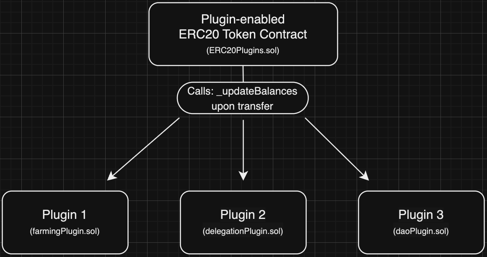
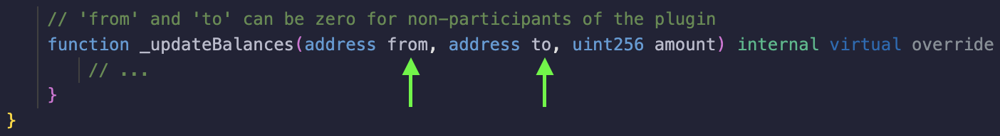

# 1inch ERC20 Token Plugins

[](https://github.com/1inch/token-plugins/actions)
[](https://codecov.io/gh/1inch/token-plugins)
[](https://www.npmjs.org/package/@1inch/token-plugins)

[Overview](#overview)  
[Primary Benefits](#primary-benefits)  
[Implementation](#implementation)  
[Deployed Examples](#deployed-examples)  
[Helpful Links](#other-helpful-links)

## Overview

Token plugins are smart contracts that extend the capabilities of ERC20 tokens and wrappers by adding custom accounting features to the original token. Inspired by the plugin concept widely used in the web 2.0 world, these plugins enable users to dynamically enhance the functionality of their tokens by subscribing to various plugins without the need to transfer tokens to a special smart contract.

The major benefit, and a key difference from existing solutions, is that these do not require token transfers to a special smart contract, as is commonly seen in farming or delegating protocols. Another beneficial point is that once an ERC20 plugin code is deployed, it can be reused by any tokens that support the 1inch plugin standard.

Support for plugins on the token side is similar to the implementation of classic ERC20 extensions (i.e., OpenZeppelin ERC20 extensions). The deployment and usage are permissionless from the perspective of a token contract owner, since the holder is the actor who decides which plugin to subscribe to.
Token plugins are smart contracts that extend the capabilities of ERC20 tokens and wrappers by adding custom accounting features to the original token. Inspired by the plugin concept widely used in the web 2.0 world, these plugins enable users to dynamically enhance the functionality of their tokens by subscribing to various plugins without the need to transfer tokens to a special smart contract.

The major benefit, and a key difference from existing solutions, is that these do not require token transfers to a special smart contract, as is commonly seen in farming or delegating protocols. Another beneficial point is that once an ERC20 plugin code is deployed, it can be reused by any tokens that support the 1inch plugin standard.

Support for plugins on the token side is similar to the implementation of classic ERC20 extensions (i.e., OpenZeppelin ERC20 extensions). The deployment and usage are permissionless from the perspective of a token contract owner, since the holder is the actor who decides which plugin to subscribe to.

Technically, plugins are a collection of smart contracts that track changes in ERC20 token balances and perform supplementary accounting tasks for those balances. They are particularly useful when you need to track, for example, token shares without actually transferring tokens to a dedicated accounting contract.

The token plugins standard is designed to be secure and to prevent asset loss, gas, and DoS attacks on transfers.

## Primary Benefits

- **100% permissionless from the token contract owner**: Open to all participants.
- **Risk-free participation**: Token plugins do not require any approval, deposit, or transfer of funds into an external contract for participation.
- **Multiple plugin connections**: Users can connect with multiple plugins, allowing for simultaneous involvement in multiple incentive programs or governance systems, etc. (subject to a predefined limit, set at deployment).
- **Simple to adopt**: Implementation is only 150 lines of code.
- **High security**: Audited by top-notch firms such as OpenZeppelin, providing the highest standard of security.
- **Built-in reentrancy protection**: [ReentrancyGuard.sol](https://github.com/1inch/token-plugins/blob/master/contracts/libs/ReentrancyGuard.sol) is integrated.
- **Custom ERC20 representation**: A plugin can be represented by its own associated ERC20 (custom inheritance), enabling a participant to receive benefits for simply holding the token.
- **Future support**: NFT (ERC721) and Multi-token (ERC1155) support are coming soon!

## Use-Cases

Here are some examples of how Token Plugins is currently being (or could be used) today:

### st1INCH resolver delegation
Staked 1INCH tokens earn rewards from Resolvers in the Intent Swap system. In order to earn rewards, the tokens must be pointed to a specific Resolver. The resolver is incentivized to have st1INCH pointed at them, so they will reward delegators with some amount of funds. The delegation of st1INCH is done with a token plugin, so there is no need to transfer the tokens to another contract.

### Weighted voting power
VE governance models like veCRV require the user to lock tokens for a certain amount of time to earn voting rights. This signals to the protocol a long-term vested interest and greatly reduces the surface area for governance attacks. With Token Plugins, this model can now be reversed and align long-term token holders with additional voting power.

### LP-Token farming
Some protocols incentivize LP token holders with additional rewards beyond swap fees through an additional yield contract that holds the LP tokens and distributes the rewards proportionally to the participating LPs. With token plugins, this extra rewards for LP holders can continue to be opt-in without the need to deposit those LP tokens into a secondary contract. (See [1inch Fusion pods](https://etherscan.io/address/0x806d9073136c8A4A3fD21E0e708a9e17C87129e8#code))

### Shadow staking
If a protocol wanted to simply reward holders of their token, they could reward them similarly to the weighted voting power method, but instead of increasing voting power over time, the APR of holding the token can increase. Long-term holders will receive rewards and short-term holders/traders would not receive the same benefit.


## Limitations

Any plugin's processing logic consumes additional gas, with external operations that change an account balance incurring higher costs. To mitigate this, the plugin extension sets a limit on the gas consumption per plugin and caps the maximum amount of gas that can be spent.

- **Plugin Quantity**: The contract deployer should establish a limit on the number of plugins managed under the plugin management contract.
- **Maximum gas usage**: The plugin management contract limits the amount of gas any plugin can use to avoid overspent and gas attacks. It is highly recommended not to change beyond the recommended amount of 140,000.
- **Only works with transferrable tokens**: By fundamental design, plugins are unable to integrate with tokens whose balances can update without transfers (such as rebase tokens).

## Implementation



Connecting a token contract with the 1inch Token Plugins is a straightforward process. If you’re creating a brand new token contract or migrating an existing one, you can simply inherit from the [plugin-enabled ERC20](https://github.com/1inch/token-plugins/blob/master/contracts/ERC20Plugins.sol) contract OR wrap an existing token and inherit plugin functionality within the wrapper (`contract MyWrapper is ERC20Wrapper, ERC20Plugins { ... }`). Subsequently, any plugin (deployed as a [separate contract](https://github.com/1inch/token-plugins/blob/master/contracts/Plugin.sol)) can be connected to your plugin-enabled ERC20, enabling it to track balance updates of the underlying asset efficiently.

In other words, 1inch Token Plugins require inheritance from an independent, “plugin-enabled” ERC20 contract, which manages all related dependent plugin contracts. The plugin-enabled ERC20 contract is responsible for calling the updateBalance function with every change in an account’s balance.

All plugins will only track the balances of participating accounts. So all non-participants are represented as “0 addresses”. If an account is not participating in a plugin and receives a plugin-enabled token, the From and To amounts under _updateBalances will be represented as 0.



For security purposes, plugins are designed with several fail-safes, including a maximum number of usable plugins, custom gas limits, a reentrancy guard, and native isolation from the main contract state. The maximum plugins and gas limit can be initialized as state variables using `MAX_PLUGINS_PER_ACCOUNT` and `PLUGIN_CALL_GAS_LIMIT`, respectively. For reentrancy prevention, `ReentrancyGuardExt` is included from OpenZeppelin’s library. Finally, for native isolation from the token contract, a single method with only three arguments (To, From, and Amount) is used. This simple architecture results in a dynamic (and risk-free!) enhancement of any ERC20 contract’s capabilities.

### Integrating plugin support in your token implementation
Technically, plugins are a collection of smart contracts that track changes in ERC20 token balances and perform supplementary accounting tasks for those balances. They are particularly useful when you need to track, for example, token shares without actually transferring tokens to a dedicated accounting contract.

The token plugins standard is designed to be secure and to prevent asset loss, gas, and DoS attacks on transfers.

## Primary Benefits

- **100% permissionless from the token contract owner**: Open to all participants.
- **Risk-free participation**: Token plugins do not require any approval, deposit, or transfer of funds into an external contract for participation.
- **Multiple plugin connections**: Users can connect with multiple plugins, allowing for simultaneous involvement in multiple incentive programs or governance systems, etc. (subject to a predefined limit, set at deployment).
- **Simple to adopt**: Implementation is only 150 lines of code.
- **High security**: Audited by top-notch firms such as OpenZeppelin, providing the highest standard of security.
- **Built-in reentrancy protection**: [ReentrancyGuard.sol](https://github.com/1inch/token-plugins/blob/master/contracts/libs/ReentrancyGuard.sol) is integrated.
- **Custom ERC20 representation**: A plugin can be represented by its own associated ERC20 (custom inheritance), enabling a participant to receive benefits for simply holding the token.
- **Future support**: NFT (ERC721) and Multi-token (ERC1155) support are coming soon!

## Use-Cases

Here are some examples of how Token Plugins is currently being (or could be used) today:

### st1INCH resolver delegation
Staked 1INCH tokens earn rewards from Resolvers in the Intent Swap system. In order to earn rewards, the tokens must be pointed to a specific Resolver. The resolver is incentivized to have st1INCH pointed at them, so they will reward delegators with some amount of funds. The delegation of st1INCH is done with a token plugin, so there is no need to transfer the tokens to another contract.

### Weighted voting power
VE governance models like veCRV require the user to lock tokens for a certain amount of time to earn voting rights. This signals to the protocol a long-term vested interest and greatly reduces the surface area for governance attacks. With Token Plugins, this model can now be reversed and align long-term token holders with additional voting power.

### LP-Token farming
Some protocols incentivize LP token holders with additional rewards beyond swap fees through an additional yield contract that holds the LP tokens and distributes the rewards proportionally to the participating LPs. With token plugins, this extra rewards for LP holders can continue to be opt-in without the need to deposit those LP tokens into a secondary contract. (See [1inch Fusion pods](https://etherscan.io/address/0x806d9073136c8A4A3fD21E0e708a9e17C87129e8#code))

### Shadow staking
If a protocol wanted to simply reward holders of their token, they could reward them similarly to the weighted voting power method, but instead of increasing voting power over time, the APR of holding the token can increase. Long-term holders will receive rewards and short-term holders/traders would not receive the same benefit.


## Limitations

Any plugin's processing logic consumes additional gas, with external operations that change an account balance incurring higher costs. To mitigate this, the plugin extension sets a limit on the gas consumption per plugin and caps the maximum amount of gas that can be spent.

- **Plugin Quantity**: The contract deployer should establish a limit on the number of plugins managed under the plugin management contract.
- **Maximum gas usage**: The plugin management contract limits the amount of gas any plugin can use to avoid overspent and gas attacks. It is highly recommended not to change beyond the recommended amount of 140,000.
- **Only works with transferrable tokens**: By fundamental design, plugins are unable to integrate with tokens whose balances can update without transfers (such as rebase tokens).

## Implementation


Connecting a token contract with the 1inch Token Plugins is a straightforward process. If you’re creating a brand new token contract or migrating an existing one, you can simply inherit from the [plugin-enabled ERC20](https://github.com/1inch/token-plugins/blob/master/contracts/ERC20Plugins.sol) contract OR wrap an existing token and inherit plugin functionality within the wrapper (`contract MyWrapper is ERC20Wrapper, ERC20Plugins { ... }`). Subsequently, any plugin (deployed as a [separate contract](https://github.com/1inch/token-plugins/blob/master/contracts/Plugin.sol)) can be connected to your plugin-enabled ERC20, enabling it to track balance updates of the underlying asset efficiently.

In other words, 1inch Token Plugins require inheritance from an independent, “plugin-enabled” ERC20 contract, which manages all related dependent plugin contracts. The plugin-enabled ERC20 contract is responsible for calling the updateBalance function with every change in an account’s balance.

All plugins will only track the balances of participating accounts. So all non-participants are represented as “0 addresses”. If an account is not participating in a plugin and receives a plugin-enabled token, the From and To amounts under _updateBalances will be represented as 0.


For security purposes, plugins are designed with several fail-safes, including a maximum number of usable plugins, custom gas limits, a reentrancy guard, and native isolation from the main contract state. The maximum plugins and gas limit can be initialized as state variables using `MAX_PLUGINS_PER_ACCOUNT` and `PLUGIN_CALL_GAS_LIMIT`, respectively. For reentrancy prevention, `ReentrancyGuardExt` is included from OpenZeppelin’s library. Finally, for native isolation from the token contract, a single method with only three arguments (To, From, and Amount) is used. This simple architecture results in a dynamic (and risk-free!) enhancement of any ERC20 contract’s capabilities.

### Integrating plugin support in your token implementation

To integrate plugins in a smart contract, a "mothership" or parent contract must be used to manage all related pods. This includes adding, removing, and viewing pods, as well as connecting multiple pods. The parent contract calls the `updateBalance` function for each pod on every update of an account’s balance. The pod then executes its logic based on the updated balance information. An account must connect a plugin to utilize its logic.
To integrate plugins in a smart contract, a "mothership" or parent contract must be used to manage all related pods. This includes adding, removing, and viewing pods, as well as connecting multiple pods. The parent contract calls the `updateBalance` function for each pod on every update of an account’s balance. The pod then executes its logic based on the updated balance information. An account must connect a plugin to utilize its logic.

1. **Inherit token**: `contract MyToken is ERC20Plugins { ... }`
   
   Or wrap it: `contract MyWrapper is ERC20Wrapper, ERC20Plugins { ... }`

   This will add support for the plugin infrastructure.
   
2. **Wallets can plugin**: `MyToken.addPlugin(plugin)`, where `plugin` is the address of your or a third-party deployed plugin.
   
3. Now every time a wallet balance changes, the plugin will know about it.

### How do accounts (users) add or remove a plugin?

To add a plugin to an account, a user-friendly web application can be developed and integrated with any injected wallet provider for simple account connection and signature. This simplifies the process of selecting and subscribing to plugins (see [1inch resolver plugins](https://app.1inch.io/#/1/dao/delegate)). Alternatively, an advanced user can subscribe to a plugin by directly interacting with the smart contract using a web3 wallet and the contract's ABI. Both methods require the user to initiate a transaction to call the `addPlugin` function of the token contract, which subscribes their account to the chosen plugin. To remove a plugin, the account needs to call either `removePlugin` or `removeAllPlugins`, depending on its needs.

### How to create your own plugin
1. **Inherit token**: `contract MyToken is ERC20Plugins { ... }`
   
   Or wrap it: `contract MyWrapper is ERC20Wrapper, ERC20Plugins { ... }`

   This will add support for the plugin infrastructure.
   
2. **Wallets can plugin**: `MyToken.addPlugin(plugin)`, where `plugin` is the address of your or a third-party deployed plugin.
   
3. Now every time a wallet balance changes, the plugin will know about it.

### How do accounts (users) add or remove a plugin?

To add a plugin to an account, a user-friendly web application can be developed and integrated with any injected wallet provider for simple account connection and signature. This simplifies the process of selecting and subscribing to plugins (see [1inch resolver plugins](https://app.1inch.io/#/1/dao/delegate)). Alternatively, an advanced user can subscribe to a plugin by directly interacting with the smart contract using a web3 wallet and the contract's ABI. Both methods require the user to initiate a transaction to call the `addPlugin` function of the token contract, which subscribes their account to the chosen plugin. To remove a plugin, the account needs to call either `removePlugin` or `removeAllPlugins`, depending on its needs.

### How to create your own plugin

To create your own plugin, it is necessary to inherit the `Plugin` contract and implement its abstract function `_updateBalances`.
To create your own plugin, it is necessary to inherit the `Plugin` contract and implement its abstract function `_updateBalances`.

1. **Inherit plugin**: `contract MyPlugin is Plugin { ... }`
2. **Implement `_updateBalances` function** to process wallet balance changes.
1. **Inherit plugin**: `contract MyPlugin is Plugin { ... }`
2. **Implement `_updateBalances` function** to process wallet balance changes.

## Generic Examples of a plugin-compatible ERC20 token and plugin
## Generic Examples of a plugin-compatible ERC20 token and plugin

Below is an example of a token implementing plugin support and a simple plugin that mints and burns its own token based on the parent’s token balance.
Below is an example of a token implementing plugin support and a simple plugin that mints and burns its own token based on the parent’s token balance.

```solidity
// Simple token contract with plugin support
contract HostTokenExample is ERC20Plugins {
    constructor(string memory name, string memory symbol, uint256 maxPluginsPerAccount, uint256 pluginCallGasLimit)
        ERC20(name, symbol)
        ERC20Plugins(maxPluginsPerAccount, pluginCallGasLimit)
    {} // solhint-disable-line no-empty-blocks

    function mint(address account, uint256 amount) external {
        _mint(account, amount);
    }
}

// Simple plugin
contract PluginExample is ERC20, Plugin {
    constructor(string memory name, string memory symbol, IERC20Plugins token_)
        ERC20(name, symbol)
        Plugin(token_)
    {} // solhint-disable-line no-empty-blocks

    function _updateBalances(address from, address to, uint256 amount) internal override {
        if (from == address(0)) {
            _mint(to, amount);
        } else if (to == address(0)) {
            _burn(from, amount);
        } else {
            _transfer(from, to, amount);
        }
    }
}
```

### Deployed Examples

- [Plugin-enabled ERC20 contract](https://arbiscan.io/token/0x36a8747fc5F09cDE48e7b8Eb073Ae911b2cBa933#code)
- [Simple Plugin contract](https://arbiscan.io/address/0x7f75495bf9a3f20b253a68a34a152c5f5587a742#code)
- [1inch Fusion (Delegated Staked 1INCH) Plugin Contract](https://etherscan.io/address/0x806d9073136c8A4A3fD21E0e708a9e17C87129e8#code)
- [1inch Fusion Staking Farm](https://etherscan.io/address/0x1A87c0F9CCA2f0926A155640e8958a8A6B0260bE#code)

### Other Helpful Links

- [Plugin-enabled ERC20 Token contract (abstract)](https://github.com/1inch/token-plugins/blob/master/contracts/ERC20Plugins.sol)
- [Plugin contract (abstract)](https://github.com/1inch/token-plugins/blob/master/contracts/Plugin.sol)
- [Anton Bukov speech at ETHCC](https://youtu.be/Is-T5Q2E0A8?feature=shared)
- [Kirill Kuznetcov speech at Nethermind Summit, Istanbul](https://youtu.be/BwehZHhR8Z4?feature=shared)

### Deployed Examples

- [Plugin-enabled ERC20 contract](https://arbiscan.io/token/0x36a8747fc5F09cDE48e7b8Eb073Ae911b2cBa933#code)
- [Simple Plugin contract](https://arbiscan.io/address/0x7f75495bf9a3f20b253a68a34a152c5f5587a742#code)
- [1inch Fusion (Delegated Staked 1INCH) Plugin Contract](https://etherscan.io/address/0x806d9073136c8A4A3fD21E0e708a9e17C87129e8#code)
- [1inch Fusion Staking Farm](https://etherscan.io/address/0x1A87c0F9CCA2f0926A155640e8958a8A6B0260bE#code)

### Other Helpful Links

- [Plugin-enabled ERC20 Token contract (abstract)](https://github.com/1inch/token-plugins/blob/master/contracts/ERC20Plugins.sol)
- [Plugin contract (abstract)](https://github.com/1inch/token-plugins/blob/master/contracts/Plugin.sol)
- [Anton Bukov speech at ETHCC](https://youtu.be/Is-T5Q2E0A8?feature=shared)
- [Kirill Kuznetcov speech at Nethermind Summit, Istanbul](https://youtu.be/BwehZHhR8Z4?feature=shared)
