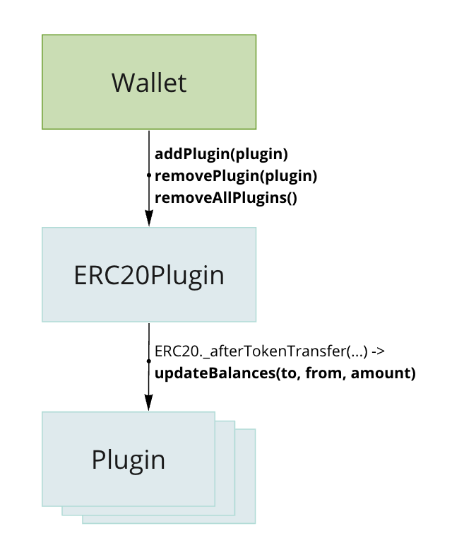

# Token Plugins

[](https://github.com/1inch/token-plugins/actions)
[](https://codecov.io/gh/1inch/token-plugins)
[](https://www.npmjs.org/package/@1inch/token-plugins)

## Overview

This library introduces an extendable and secure system for ERC20-based tokens, inspired by the plugin concept widely used in the web 2.0 world. By subscribing an account to various plugins, users can dynamically enhance the functionality of their tokens.

Technically plugins are a collection of smart contracts that track changes in ERC20 token balances and perform supplementary accounting tasks for those balances. They are particularly useful when you need to track, for example, token shares without actually transferring tokens to an accounting contract.

## How does it work and what can I extend?

Each time a balance of a connected account changes, the token contract notifies all plugins that the account has subscribed to. Each plugin implements the `_updateBalances` function, which is called on mint, burn and transfer, and includes change information like from and to addresses and amount. This way a plugin can perform necessary actions according to its logic to extend the base token functionality.

Keep in mind that the plugin's processing logic consumes additional gas, and operations that change an account balance will be more expensive in terms of gas. To reduce the gas impact the library implements a limit on the amount of gas that a plugin can spend and an account owner can choose which plugins to subscribe his account to.



Picture 1. Possible interactions

## Implementation examples

The examples of already implemented token-plugins

- [FarmingPlugin](https://github.com/1inch/farming) - *The 1inch staking reward farming is based on this plugin.*
This plugin introduces farming without the need for asset transfer or locking on a farm. An account owner can join the farm by simply adding this plugin to their account. The plugin handles all necessary accounting for joined farmers and distributes rewards based on the actual farming token balance of the account during the farming period. This is particularly useful for non-transferable tokens, for example such as debt tokens in lending protocols.
- [DelegatingPlugin](https://github.com/1inch/delegating) - *The 1inch fusion mode resolver delegation is based on this plugin.*
This plugin allows an account balance to be delegated to another address. This can be beneficial for governance tokens if an account owner wants to delegate their voting power to another account without a physical token transfer. The owner can recall or redelegate their delegation at any time without locking their tokens in a governance contract.

## Security and limitations

The plugin system operates under the assumption that an account may subscribe to a malicious plugin. That is the reason why the following restrictions apply:

- If a plugin fails its execution and reverts, it won't impact the main flow. The failed plugin is bypassed, and execution continues.
- Each plugin has a gas limit set by the parent contract. If there is insufficient gas, it won't affect the main flow's execution.
- An account can have a limited number of plugins connected, set by host contract.
- Plugins are executed in the context specified in their contract (parent contract uses a call, not delegatecall).
- Plugins cannot alter the calling contract state
- Plugins cannot be reentered

## Integrating plugin support in your token implementation

To integrate plugins in a smart contract, a "mothership" or parent contract have to be used to manage all related pods. This includes adding, removing, and viewing pods, as well as connecting multiple pods. The parent contract calls the `updateBalance` function for each pod on every update of an account’s balance. The pod then executes its logic based on the updated balance information. And then an account has to connect plugin to the account to utilize its logic. 

1. Inherit token: `contract MyToken is ERC20Plugins { ... }`
    
    Or wrap it: `contract MyWrapper is ERC20Wrapper, ERC20Plugins { ... }`
    
    This will add support for the plugin infrastructure.
    
2. Wallets can plugin: `MyToken.addPlugin(plugin)`, where `plugin` is address of your and third-party deployed plugin.
3. Now every time wallet balance is change the plugin will know about it

## How to create your own plugin

To create your own plugin it is necessary to inherit `Plugin` contract and implement its abstract function `_updateBalances`.

1. Inherit plugin: `contract MyPlugin is Plugin { ... }`
2. Implement `_updateBalances` function to process wallet balance changes

## Examples of token and plugin

Below is the example of token implementing plugin support and a simple plugin that mints and burns its own token based on the parent’s token balance


```solidity
// Simple token contract with plugin support
contract HostTokenExample is ERC20Plugins {
    constructor(string memory name, string memory symbol, uint256 maxPluginsPerAccount, uint256 pluginsCallGasLimit)
        ERC20(name, symbol)
        ERC20Plugins(maxPluginsPerAccount, pluginsCallGasLimit)
    {} // solhint-disable-line no-empty-blocks

    function mint(address account, uint256 amount) external {
        _mint(account, amount);
    }
}

// Simple plugin
contract PluginExample is ERC20, Plugin {
    constructor(string memory name, string memory symbol, IERC20Plugins token_)
        ERC20(name, symbol)
        Plugin(token_)
    {} // solhint-disable-line no-empty-blocks

    function _updateBalances(address from, address to, uint256 amount) internal override {
        if (from == address(0)) {
            _mint(to, amount);
        } else if (to == address(0)) {
            _burn(from, amount);
        } else {
            _transfer(from, to, amount);
        }
    }
}
```
